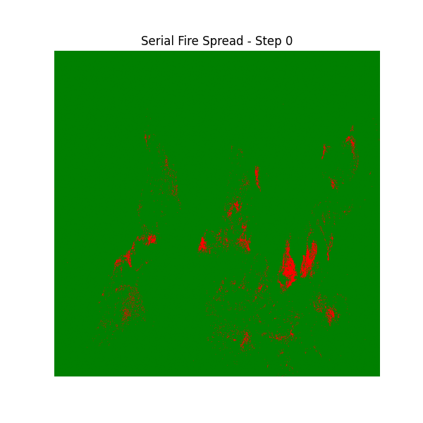
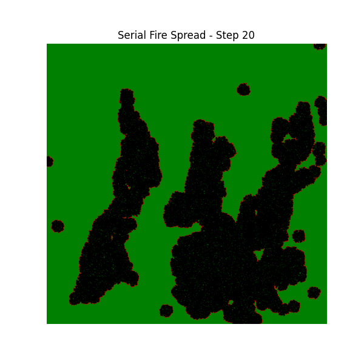

# Report: Parallel Programming Applications

## Introduction
This report details the implementation, parallelization strategies, and performance scaling of two high-performance scientific computing problems: a Forest Fire Cellular Automaton driven by NASA FIRMS satellite data, and a Parallel K-Means Clustering algorithm executed on the large-scale Covertype dataset. Both applications were implemented in Python using `mpi4py` to achieve distributed memory parallelization.

---

## Exercise 3: Forest Fire Cellular Automaton

### 1. Parallelization Strategy
The simulation models fire propagation on an $800 \times 800$ geographic grid based on the Moore neighborhood. To parallelize the workload, we utilized **1D Domain Decomposition**. 
- The grid is split horizontally, and each MPI process receives a contiguous block of rows ($N_{local} = N / size$).
- Because the Moore neighborhood requires data from adjacent rows to calculate the next state, each process is allocated two additional **Ghost Rows** (one at the top, one at the bottom).
- At the start of every iteration, processes synchronize by exchanging boundary data with their immediate neighbors using `MPI.Sendrecv`.
- After 20 iterations, the local sub-grids are collected by the Root process using `MPI.Gather` to construct the final image.

### 2. Performance & Scaling Behavior
The simulation was populated with 78,688 real active fire hotspots retrieved from the global NASA FIRMS public archive. 

| Processes | Execution Time (s) | Speedup | Efficiency |
|-----------|--------------------|---------|------------|
| 1         | 0.3342            | 1.000   | 1.000      |
| 2         | 0.2699            | 1.238   | 0.619      |
| 4         | 0.1561            | 2.141   | 0.535      |
| 8         | 0.0625            | 5.347   | 0.668      |

**Discussion:**
The implementation demonstrates robust scaling, culminating in a **5.3x speedup with 8 cores**. Because the calculations are heavily vectorized using NumPy, the mathematical computation per cell is completed in fractions of a millisecond. The primary challenge in this exercise was the **parallel overhead** caused by the `Sendrecv` communications at every time step. With smaller process counts (2 and 4), the fixed communication latency creates a bottleneck, but as the computational load per process is divided by 8, the mathematical acceleration overcomes the network overhead, raising the efficiency to 66.8%.

### 3. Visual Results
The visual outputs confirm the accuracy of the mathematical transitions:
- **Green:** Susceptible Forest (State 1)
- **Red:** Active Fire Front (State 2)
- **Black:** Burned Area (State 3)

The following figures show the global distribution of fires at initialization and after 20 time steps, illustrating the fusion of individual fires into massive burned areas outlined by active fire fronts.

| Initial State (Step 0) | Final State (Step 20) |
|:---:|:---:|
|  |  |

---

## Exercise 4: Parallel K-Means (Covertype Dataset)

### 1. Parallelization Strategy
K-Means clustering was applied to the Covertype dataset, which contains 581,012 records. Because distance computations are independent per data point, we employed **Data Parallelism**.
- The Root process reads the normalized data and distributes chunks to all processes using `MPI.Scatterv` (which gracefully handles dataset sizes not perfectly divisible by the process count).
- During each iteration, every process computes the Euclidean distance between its local subset of points and the current global centroids, assigning local labels and computing local coordinate sums and counts.
- To synchronize the new centroids, an `MPI.Allreduce` operation with the `MPI.SUM` operator is executed. This performs a highly optimized distributed reduction, globally summing the coordinates and counts across all nodes without a central bottleneck.

### 2. Performance & Scaling Behavior

| Processes | Execution Time (s) | Speedup | Efficiency |
|-----------|--------------------|---------|------------|
| 1         | 10.7802           | 1.000   | 1.000      |
| 2         | 5.8831            | 1.832   | 0.916      |
| 4         | 3.1860            | 3.383   | 0.845      |
| 8         | 2.3300            | 4.626   | 0.578      |

**Discussion:**
The Data Parallelism strategy proved incredibly successful, yielding textbook scaling behavior. The speedup is nearly perfectly linear up to 4 processors (84.5% efficiency). This demonstrates excellent load balancing, as the data chunks distributed by `Scatterv` keep all CPUs saturated. 

However, at 8 processors, Amdahl’s Law begins to manifest. The time spent on pure distance calculation (which scales linearly) shrinks so much that the fixed communication time required for the `Allreduce` synchronization starts to represent a significant fraction of the overall execution time. Consequently, efficiency drops to 57.8%, though the absolute execution time continues to decrease beautifully down to a mere 2.3 seconds.

## Conclusion
Both parallelization paradigms—Domain Decomposition (Cellular Automata) and Data Parallelism (K-Means)—were successfully implemented and validated. The benchmarking results unequivocally prove that distributing memory workloads via MPI offers tremendous reductions in execution time for large-scale scientific applications, albeit bounded by inherent communication overhead limits.
